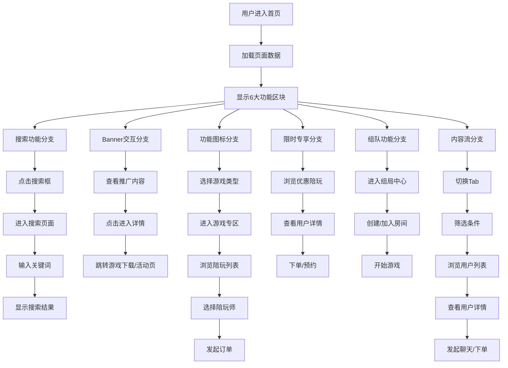

# UI Design Grid Architecture System - Claude
`2025-09-11 05:00:00`

_User_:
学习这个文档
现在的AI视觉能力很强，但是不能准确描述好位置等信息，我希望能使用基于百分比的栅格系统进行描述，同时输出这样的
"结构架构图"
给我一下介绍和分析，我要怎么指导或者理解这种格式或者让其他人书写类似的格式，同时我还觉得这种格式还是太宽松了，我希望每个子模块都要有超级详细的描述

我通常拿一整张UI图来分析产出
一张UI图通常由4-6个子功能模块组成
我觉得每个子功能模块都极为细节复杂（样式）
我们专注排版布局，功能逻辑会列一张带有分支的流程图来猜测可能的走向


_Claude_:
Devised precise grid-based UI description system for detailed analysis

用户想要了解如何用基于百分比的栅格系统来描述UI设计，并且希望有一个更严格、更详细的格式来描述每个子模块。他们提到：

AI视觉能力强但位置描述不准确
希望使用百分比栅格系统
现有格式太宽松，需要更详细的子模块描述
一张UI图通常4-6个子功能模块
每个子模块样式复杂
专注排版布局，功能逻辑用流程图表示

我需要设计一个更严格、更精确的架构描述系统，基于百分比栅格，并且每个子模块都有超级详细的描述。

基于你的需求，我来设计一个超精确的百分比栅格架构系统，专门用于UI图像的结构化描述：

📐 百分比栅格架构系统 (PGAS - Percentage Grid Architecture System)
🎯 核心设计理念
【设计原则】
1. 位置精确化：所有元素使用百分比定位，精确到0.1%
2. 尺寸标准化：使用相对尺寸，确保响应式适配
3. 层级强制化：严格的5层嵌套结构，不可跳级
4. 描述原子化：每个最小元素都必须完整描述
5. 样式量化：所有视觉属性必须数值化表达
📊 栅格坐标系统
【12列栅格定位系统】
┌─────────────────────────────────────────┐
│ 0%   8.33%  16.67%  25%   33.33%  41.67% │  X轴
│      50%    58.33%  66.67%  75%   83.33% │
│                    91.67%         100%    │
├─────────────────────────────────────────┤
│ 垂直分割：每10%为一个基准线              │  Y轴
│ 0% → 10% → 20% → ... → 90% → 100%       │
└─────────────────────────────────────────┘

【定位语法】
元素位置 = {
  x: [起始列, 结束列] // 0-12列
  y: [起始%, 结束%]   // 0-100%
  z: 层级索引         // 0-999
}
🏗️ 五层强制嵌套结构
L0: 画布层 (Canvas) - 100% × 100%
└── L1: 区块层 (Block) - 主要功能区块 4-6个
    └── L2: 容器层 (Container) - 功能容器 3-5个/区块
        └── L3: 组件层 (Component) - UI组件 5-10个/容器
            └── L4: 元素层 (Element) - 原子元素 2-8个/组件
📋 超详细子模块描述模板
yaml
【子模块标准描述格式】
module_id: "M001_header_navigation"
module_level: "L1"
module_type: "navigation_bar"

# 1. 位置与尺寸 (必填)
position:
  grid_x: [0, 12]      # 占满12列
  grid_y: [0%, 8.5%]   # 顶部8.5%高度
  z_index: 100         # 层级
  absolute: false      # 是否绝对定位
  
dimensions:
  width: "100%"        # 宽度
  height: "64px"       # 高度(可选固定值)
  min_height: "56px"   # 最小高度
  max_height: "88px"   # 最大高度
  aspect_ratio: null   # 宽高比

# 2. 布局系统 (必填)
layout:
  type: "flex"         # flex/grid/absolute/relative
  direction: "row"     # row/column
  justify: "space-between"
  align: "center"
  gap: "16px"
  padding: 
    top: "8px"
    right: "16px"
    bottom: "8px"
    left: "16px"
  margin: "0"

# 3. 视觉样式 (必填)
visual:
  background:
    type: "solid"      # solid/gradient/image
    color: "#FFFFFF"
    opacity: 1.0
  border:
    width: "0 0 1px 0"
    style: "solid"
    color: "#E5E5E5"
    radius: "0"
  shadow:
    x: 0
    y: 2
    blur: 4
    spread: 0
    color: "rgba(0,0,0,0.1)"
  
# 4. 子元素列表 (必填)
children:
  - id: "logo_area"
    grid_x: [0, 2]     # 占据前2列
    grid_y: [25%, 75%] # 垂直居中
    type: "image"
    content: "logo.svg"
    size: "32×32px"
    
  - id: "title_area"
    grid_x: [2, 10]    # 占据中间8列
    grid_y: [35%, 65%] # 垂直居中
    type: "text"
    content: "页面标题"
    style:
      font_size: "18px"
      font_weight: 600
      color: "#333333"
      text_align: "center"
      
  - id: "action_area"
    grid_x: [10, 12]   # 占据最后2列
    grid_y: [25%, 75%] # 垂直居中
    type: "button_group"
    buttons: 3
    gap: "8px"

# 5. 交互状态 (必填)
states:
  default:
    opacity: 1.0
    transform: "none"
  scrolled:
    background: "#FFFFFF"
    shadow: "0 2px 8px rgba(0,0,0,0.15)"
  hidden:
    transform: "translateY(-100%)"
    
# 6. 响应式断点 (必填)
responsive:
  mobile:  # <768px
    height: "56px"
    padding: "8px 12px"
  tablet:  # 768-1024px
    height: "64px"
    padding: "8px 16px"
  desktop: # >1024px
    height: "72px"
    padding: "12px 24px"

# 7. 动画配置 (可选)
animations:
  enter:
    duration: "300ms"
    easing: "ease-out"
    delay: "0ms"
  exit:
    duration: "200ms"
    easing: "ease-in"
🎨 实际应用示例

让我用这个系统描述一个典型的移动端首页：

【移动端首页架构图】
━━━━━━━━━━━━━━━━━━━━━━━━━━━━━━━━━━━━━
L0: 画布 [100% × 100%]
┃
┣━ L1.1: 顶部导航栏 [0-12列, 0%-8%]
┃  ┣━ L2.1: 状态栏容器 [0-12列, 0%-3%]
┃  ┃  ┣━ L3.1: 时间组件 [0-3列, 25%-75%]
┃  ┃  ┃  └━ L4.1: 时间文本 "9:41"
┃  ┃  ┗━ L3.2: 系统图标组 [9-12列, 25%-75%]
┃  ┃     ├━ L4.2: 信号图标
┃  ┃     ├━ L4.3: WiFi图标
┃  ┃     └━ L4.4: 电池图标
┃  ┗━ L2.2: 导航栏容器 [0-12列, 3%-8%]
┃     ┣━ L3.3: 返回按钮 [0-2列, 20%-80%]
┃     ┣━ L3.4: 标题文本 [2-10列, 30%-70%]
┃     ┗━ L3.5: 操作按钮 [10-12列, 20%-80%]
┃
┣━ L1.2: 搜索栏区域 [0-12列, 8%-15%]
┃  ┗━ L2.3: 搜索框容器 [1-11列, 15%-85%]
┃     ┣━ L3.6: 搜索图标 [0-1.5列, 25%-75%]
┃     ┣━ L3.7: 输入区域 [1.5-9列, 20%-80%]
┃     ┗━ L3.8: 语音按钮 [9-10.5列, 25%-75%]
┃
┣━ L1.3: 轮播图区域 [0-12列, 15%-35%]
┃  ┗━ L2.4: 轮播容器 [0.5-11.5列, 5%-95%]
┃     ┣━ L3.9: 图片展示区 [0-12列, 0%-85%]
┃     ┗━ L3.10: 指示器组 [4-8列, 85%-100%]
┃
┣━ L1.4: 功能入口区 [0-12列, 35%-50%]
┃  ┗━ L2.5: 图标网格容器 [0.5-11.5列, 5%-95%]
┃     ┣━ L3.11: 功能图标1 [0-3列, 0%-50%]
┃     ┣━ L3.12: 功能图标2 [3-6列, 0%-50%]
┃     ┣━ L3.13: 功能图标3 [6-9列, 0%-50%]
┃     ┣━ L3.14: 功能图标4 [9-12列, 0%-50%]
┃     ┣━ L3.15: 功能图标5 [0-3列, 50%-100%]
┃     ┣━ L3.16: 功能图标6 [3-6列, 50%-100%]
┃     ┣━ L3.17: 功能图标7 [6-9列, 50%-100%]
┃     ┗━ L3.18: 功能图标8 [9-12列, 50%-100%]
┃
┣━ L1.5: 内容列表区 [0-12列, 50%-92%]
┃  ┗━ L2.6: 列表容器 [0-12列, 0%-100%]
┃     ┣━ L3.19: 列表项1 [0.5-11.5列, 0%-25%]
┃     ┣━ L3.20: 列表项2 [0.5-11.5列, 25%-50%]
┃     ┣━ L3.21: 列表项3 [0.5-11.5列, 50%-75%]
┃     ┗━ L3.22: 列表项4 [0.5-11.5列, 75%-100%]
┃
┗━ L1.6: 底部导航栏 [0-12列, 92%-100%]
   ┗━ L2.7: Tab容器 [0-12列, 0%-100%]
      ┣━ L3.23: Tab1 [0-3列, 15%-85%]
      ┣━ L3.24: Tab2 [3-6列, 15%-85%]
      ┣━ L3.25: Tab3 [6-9列, 15%-85%]
      ┗━ L3.26: Tab4 [9-12列, 15%-85%]
━━━━━━━━━━━━━━━━━━━━━━━━━━━━━━━━━━━━━
💡 使用指导

1. 给AI的提示词模板：

请使用PGAS系统分析这张UI图：
1. 识别4-6个L1级主要区块，使用百分比定位
2. 每个L1区块细分3-5个L2容器
3. 每个L2容器描述5-10个L3组件
4. 关键L3组件分解为L4原子元素
5. 所有位置用12列栅格+百分比高度表示
6. 样式属性必须包含：颜色值、像素值、百分比
7. 输出YAML格式的详细描述

2. 质量验证清单：

 每个模块都有唯一ID
 位置使用栅格坐标精确描述
 尺寸包含响应式断点
 颜色使用HEX或RGBA
 间距使用像素值
 包含至少3种交互状态
 子元素关系清晰完整

3. 样式复杂度处理：

yaml
# 对于复杂样式，使用分层描述
complex_style:
  base_layer:    # 基础样式
    background: "#FFFFFF"
  gradient_layer: # 渐变覆盖
    type: "linear"
    angle: 45
    stops: ["#FF0000", "#00FF00"]
  texture_layer:  # 纹理叠加
    image: "texture.png"
    opacity: 0.1
  effect_layer:   # 特效层
    blur: 2
    brightness: 1.1

这个系统的优势：

位置精确：百分比栅格消除歧义
结构严格：5层强制嵌套，不可省略
描述完整：每个细节都有标准字段
易于验证：可自动检查完整性
跨平台适配：响应式设计内置

需要我针对特定类型的UI（如电商、社交、工具类）定制更详细的模板吗？

```
【设计原则】
1. 位置精确化：所有元素使用百分比定位，精确到0.1%
2. 尺寸标准化：使用相对尺寸，确保响应式适配
3. 层级强制化：严格的5层嵌套结构，不可跳级
4. 描述原子化：每个最小元素都必须完整描述
5. 样式量化：所有视觉属性必须数值化表达
```

```
【12列栅格定位系统】
┌─────────────────────────────────────────┐
│ 0%   8.33%  16.67%  25%   33.33%  41.67% │  X轴
│      50%    58.33%  66.67%  75%   83.33% │
│                    91.67%         100%    │
├─────────────────────────────────────────┤
│ 垂直分割：每10%为一个基准线              │  Y轴
│ 0% → 10% → 20% → ... → 90% → 100%       │
└─────────────────────────────────────────┘

【定位语法】
元素位置 = {
  x: [起始列, 结束列] // 0-12列
  y: [起始%, 结束%]   // 0-100%
  z: 层级索引         // 0-999
}
```

```
L0: 画布层 (Canvas) - 100% × 100%
└── L1: 区块层 (Block) - 主要功能区块 4-6个
    └── L2: 容器层 (Container) - 功能容器 3-5个/区块
        └── L3: 组件层 (Component) - UI组件 5-10个/容器
            └── L4: 元素层 (Element) - 原子元素 2-8个/组件
```

```yaml
【子模块标准描述格式】
module_id: "M001_header_navigation"
module_level: "L1"
module_type: "navigation_bar"

# 1. 位置与尺寸 (必填)
position:
  grid_x: [0, 12]      # 占满12列
  grid_y: [0%, 8.5%]   # 顶部8.5%高度
  z_index: 100         # 层级
  absolute: false      # 是否绝对定位
  
dimensions:
  width: "100%"        # 宽度
  height: "64px"       # 高度(可选固定值)
  min_height: "56px"   # 最小高度
  max_height: "88px"   # 最大高度
  aspect_ratio: null   # 宽高比

# 2. 布局系统 (必填)
layout:
  type: "flex"         # flex/grid/absolute/relative
  direction: "row"     # row/column
  justify: "space-between"
  align: "center"
  gap: "16px"
  padding: 
    top: "8px"
    right: "16px"
    bottom: "8px"
    left: "16px"
  margin: "0"

# 3. 视觉样式 (必填)
visual:
  background:
    type: "solid"      # solid/gradient/image
    color: "#FFFFFF"
    opacity: 1.0
  border:
    width: "0 0 1px 0"
    style: "solid"
    color: "#E5E5E5"
    radius: "0"
  shadow:
    x: 0
    y: 2
    blur: 4
    spread: 0
    color: "rgba(0,0,0,0.1)"
  
# 4. 子元素列表 (必填)
children:
  - id: "logo_area"
    grid_x: [0, 2]     # 占据前2列
    grid_y: [25%, 75%] # 垂直居中
    type: "image"
    content: "logo.svg"
    size: "32×32px"
    
  - id: "title_area"
    grid_x: [2, 10]    # 占据中间8列
    grid_y: [35%, 65%] # 垂直居中
    type: "text"
    content: "页面标题"
    style:
      font_size: "18px"
      font_weight: 600
      color: "#333333"
      text_align: "center"
      
  - id: "action_area"
    grid_x: [10, 12]   # 占据最后2列
    grid_y: [25%, 75%] # 垂直居中
    type: "button_group"
    buttons: 3
    gap: "8px"

# 5. 交互状态 (必填)
states:
  default:
    opacity: 1.0
    transform: "none"
  scrolled:
    background: "#FFFFFF"
    shadow: "0 2px 8px rgba(0,0,0,0.15)"
  hidden:
    transform: "translateY(-100%)"
    
# 6. 响应式断点 (必填)
responsive:
  mobile:  # <768px
    height: "56px"
    padding: "8px 12px"
  tablet:  # 768-1024px
    height: "64px"
    padding: "8px 16px"
  desktop: # >1024px
    height: "72px"
    padding: "12px 24px"

# 7. 动画配置 (可选)
animations:
  enter:
    duration: "300ms"
    easing: "ease-out"
    delay: "0ms"
  exit:
    duration: "200ms"
    easing: "ease-in"
```

```
【移动端首页架构图】
━━━━━━━━━━━━━━━━━━━━━━━━━━━━━━━━━━━━━
L0: 画布 [100% × 100%]
┃
┣━ L1.1: 顶部导航栏 [0-12列, 0%-8%]
┃  ┣━ L2.1: 状态栏容器 [0-12列, 0%-3%]
┃  ┃  ┣━ L3.1: 时间组件 [0-3列, 25%-75%]
┃  ┃  ┃  └━ L4.1: 时间文本 "9:41"
┃  ┃  ┗━ L3.2: 系统图标组 [9-12列, 25%-75%]
┃  ┃     ├━ L4.2: 信号图标
┃  ┃     ├━ L4.3: WiFi图标
┃  ┃     └━ L4.4: 电池图标
┃  ┗━ L2.2: 导航栏容器 [0-12列, 3%-8%]
┃     ┣━ L3.3: 返回按钮 [0-2列, 20%-80%]
┃     ┣━ L3.4: 标题文本 [2-10列, 30%-70%]
┃     ┗━ L3.5: 操作按钮 [10-12列, 20%-80%]
┃
┣━ L1.2: 搜索栏区域 [0-12列, 8%-15%]
┃  ┗━ L2.3: 搜索框容器 [1-11列, 15%-85%]
┃     ┣━ L3.6: 搜索图标 [0-1.5列, 25%-75%]
┃     ┣━ L3.7: 输入区域 [1.5-9列, 20%-80%]
┃     ┗━ L3.8: 语音按钮 [9-10.5列, 25%-75%]
┃
┣━ L1.3: 轮播图区域 [0-12列, 15%-35%]
┃  ┗━ L2.4: 轮播容器 [0.5-11.5列, 5%-95%]
┃     ┣━ L3.9: 图片展示区 [0-12列, 0%-85%]
┃     ┗━ L3.10: 指示器组 [4-8列, 85%-100%]
┃
┣━ L1.4: 功能入口区 [0-12列, 35%-50%]
┃  ┗━ L2.5: 图标网格容器 [0.5-11.5列, 5%-95%]
┃     ┣━ L3.11: 功能图标1 [0-3列, 0%-50%]
┃     ┣━ L3.12: 功能图标2 [3-6列, 0%-50%]
┃     ┣━ L3.13: 功能图标3 [6-9列, 0%-50%]
┃     ┣━ L3.14: 功能图标4 [9-12列, 0%-50%]
┃     ┣━ L3.15: 功能图标5 [0-3列, 50%-100%]
┃     ┣━ L3.16: 功能图标6 [3-6列, 50%-100%]
┃     ┣━ L3.17: 功能图标7 [6-9列, 50%-100%]
┃     ┗━ L3.18: 功能图标8 [9-12列, 50%-100%]
┃
┣━ L1.5: 内容列表区 [0-12列, 50%-92%]
┃  ┗━ L2.6: 列表容器 [0-12列, 0%-100%]
┃     ┣━ L3.19: 列表项1 [0.5-11.5列, 0%-25%]
┃     ┣━ L3.20: 列表项2 [0.5-11.5列, 25%-50%]
┃     ┣━ L3.21: 列表项3 [0.5-11.5列, 50%-75%]
┃     ┗━ L3.22: 列表项4 [0.5-11.5列, 75%-100%]
┃
┗━ L1.6: 底部导航栏 [0-12列, 92%-100%]
   ┗━ L2.7: Tab容器 [0-12列, 0%-100%]
      ┣━ L3.23: Tab1 [0-3列, 15%-85%]
      ┣━ L3.24: Tab2 [3-6列, 15%-85%]
      ┣━ L3.25: Tab3 [6-9列, 15%-85%]
      ┗━ L3.26: Tab4 [9-12列, 15%-85%]
━━━━━━━━━━━━━━━━━━━━━━━━━━━━━━━━━━━━━
```

```
请使用PGAS系统分析这张UI图：
1. 识别4-6个L1级主要区块，使用百分比定位
2. 每个L1区块细分3-5个L2容器
3. 每个L2容器描述5-10个L3组件
4. 关键L3组件分解为L4原子元素
5. 所有位置用12列栅格+百分比高度表示
6. 样式属性必须包含：颜色值、像素值、百分比
7. 输出YAML格式的详细描述
```

```yaml
# 对于复杂样式，使用分层描述
complex_style:
  base_layer:    # 基础样式
    background: "#FFFFFF"
  gradient_layer: # 渐变覆盖
    type: "linear"
    angle: 45
    stops: ["#FF0000", "#00FF00"]
  texture_layer:  # 纹理叠加
    image: "texture.png"
    opacity: 0.1
  effect_layer:   # 特效层
    blur: 2
    brightness: 1.1
```


_Claude_:
用户想要了解如何用基于百分比的栅格系统来描述UI设计，并且希望有一个更严格、更详细的格式来描述每个子模块。他们提到：

AI视觉能力强但位置描述不准确
希望使用百分比栅格系统
现有格式太宽松，需要更详细的子模块描述
一张UI图通常4-6个子功能模块
每个子模块样式复杂
专注排版布局，功能逻辑用流程图表示

我需要设计一个更严格、更精确的架构描述系统，基于百分比栅格，并且每个子模块都有超级详细的描述。


_User_:
让我们尝试


_Claude_:
分析移动应用界面，准备使用PGAS系统评估

用户上传了一张移动应用界面的截图，看起来是一个紫色主题的应用首页。让我使用刚才设计的PGAS系统来分析这张UI图。

我需要：

识别主要的L1级区块
细分每个区块的L2容器
描述L3组件和L4元素
使用百分比栅格定位
提供详细的样式描述

让我仔细观察这张图...

📐 PGAS系统UI架构分析

基于你提供的紫色主题应用界面，我来使用百分比栅格系统进行超详细的结构化分析：

yaml
【应用首页完整架构描述】
canvas_dimensions: 375×812px (iOS标准)
primary_color: "#9B51E0"
background: "#FFFFFF"

# ━━━━━━━━━━━━━━━━━━━━━━━━━━━━━━━━━━━
# L1.1: 顶部状态导航区 [0-12列, 0%-11%]
# ━━━━━━━━━━━━━━━━━━━━━━━━━━━━━━━━━━━
L1_1_header:
  position:
    grid_x: [0, 12]
    grid_y: [0%, 11%]
    z_index: 1000
  
  # L2.1: 系统状态栏 [0-12列, 0%-5.4%]
  L2_1_status_bar:
    position: 
      grid_x: [0, 12]
      grid_y: [0%, 5.4%]
    background: "#9B51E0"
    
    # L3.1: 时间显示
    L3_1_time:
      grid_x: [0.5, 2.5]
      grid_y: [30%, 70%]
      content: "9:41"
      style:
        font_size: "15px"
        font_weight: 600
        color: "#FFFFFF"
    
    # L3.2: 系统图标组
    L3_2_system_icons:
      grid_x: [9, 11.5]
      grid_y: [30%, 70%]
      icons:
        - signal: "3/4 bars"
        - wifi: "full"
        - battery: "85%"
  
  # L2.2: 紫色搜索栏 [0-12列, 5.4%-11%]
  L2_2_search_bar:
    position:
      grid_x: [0, 12]
      grid_y: [5.4%, 11%]
    background: "#9B51E0"
    padding: "8px 16px 12px 16px"
    
    # L3.3: 位置标记
    L3_3_location:
      grid_x: [0.5, 2]
      grid_y: [25%, 75%]
      components:
        - icon: "location_pin"
          size: "16×16px"
          color: "#FFFFFF"
        - text: "深圳"
          font_size: "14px"
          color: "#FFFFFF"
    
    # L3.4: 搜索框
    L3_4_search_input:
      grid_x: [2.5, 11.5]
      grid_y: [20%, 80%]
      background: "rgba(255,255,255,0.2)"
      border_radius: "20px"
      padding: "0 16px"
      placeholder: "搜索词"
      icon_left: "search"
      text_color: "#FFFFFF"

# ━━━━━━━━━━━━━━━━━━━━━━━━━━━━━━━━━━━
# L1.2: 营销Banner区 [0-12列, 11%-29%]
# ━━━━━━━━━━━━━━━━━━━━━━━━━━━━━━━━━━━
L1_2_banner:
  position:
    grid_x: [0, 12]
    grid_y: [11%, 29%]
    z_index: 100
  
  # L2.3: Banner容器
  L2_3_banner_container:
    position:
      grid_x: [0.5, 11.5]
      grid_y: [5%, 95%]
    border_radius: "12px"
    overflow: "hidden"
    
    # L3.5: 游戏推广图
    L3_5_game_banner:
      type: "image"
      content: "DELTA FORCE"
      aspect_ratio: "16:9"
      overlay_text:
        chinese: "独家首发 国民玩家喊灾"
        style:
          font_size: "24px"
          font_weight: "bold"
          text_shadow: "0 2px 4px rgba(0,0,0,0.5)"

# ━━━━━━━━━━━━━━━━━━━━━━━━━━━━━━━━━━━
# L1.3: 功能入口矩阵 [0-12列, 29%-44%]
# ━━━━━━━━━━━━━━━━━━━━━━━━━━━━━━━━━━━
L1_3_function_grid:
  position:
    grid_x: [0, 12]
    grid_y: [29%, 44%]
  padding: "16px 12px"
  
  # L2.4: 图标网格容器（2行×5列）
  L2_4_icon_grid:
    layout: "grid"
    columns: 5
    rows: 2
    gap: "0px"
    
    # L3.6-15: 功能图标项
    icons:
      - L3_6:
          grid_pos: [0, 0]
          icon: "crown"
          label: "王者荣耀"
          icon_style:
            background: "linear-gradient(135deg, #FF6B6B, #FFB366)"
            size: "48×48px"
            border_radius: "12px"
      
      - L3_7:
          grid_pos: [1, 0]
          icon: "league"
          label: "英雄联盟"
          icon_style:
            background: "#1E3A5F"
            size: "48×48px"
            border_radius: "12px"
      
      - L3_8:
          grid_pos: [2, 0]
          icon: "peace_elite"
          label: "和平精英"
          icon_style:
            background: "#FFC107"
            size: "48×48px"
            border_radius: "12px"
      
      # ... 省略其他图标详细描述

# ━━━━━━━━━━━━━━━━━━━━━━━━━━━━━━━━━━━
# L1.4: 限时专享区 [0-12列, 44%-62%]
# ━━━━━━━━━━━━━━━━━━━━━━━━━━━━━━━━━━━
L1_4_limited_offers:
  position:
    grid_x: [0, 12]
    grid_y: [44%, 62%]
  
  # L2.5: 标题栏
  L2_5_section_header:
    grid_x: [0, 12]
    grid_y: [0%, 20%]
    padding: "0 16px"
    
    # L3.16: 标题文本
    L3_16_title:
      grid_x: [0, 6]
      content: "限时专享"
      font_size: "18px"
      font_weight: 600
      
    # L3.17: 热门标签
    L3_17_hot_tag:
      grid_x: [4, 6]
      background: "#FF5722"
      text: "优惠限抢"
      padding: "2px 8px"
      border_radius: "12px"
      font_size: "12px"
      color: "#FFFFFF"
    
    # L3.18: 更多按钮
    L3_18_more:
      grid_x: [10, 12]
      text: "更多 >"
      color: "#999999"
      font_size: "14px"
  
  # L2.6: 卡片列表容器
  L2_6_cards_container:
    grid_x: [0, 12]
    grid_y: [20%, 100%]
    scroll: "horizontal"
    padding: "0 16px"
    
    # L3.19-21: 用户卡片
    cards:
      - L3_19_card_1:
          width: "30%"
          height: "100%"
          margin_right: "8px"
          content:
            avatar: "user_avatar_1.jpg"
            avatar_size: "80×80px"
            badge: "距离90人下单"
            username: "用户123"
            service: "陪玩区 荣耀王者"
            border_radius: "8px"
            background: "#F5F5F5"

# ━━━━━━━━━━━━━━━━━━━━━━━━━━━━━━━━━━━
# L1.5: 组队聚会区 [0-12列, 62%-73%]
# ━━━━━━━━━━━━━━━━━━━━━━━━━━━━━━━━━━━
L1_5_team_section:
  position:
    grid_x: [0, 12]
    grid_y: [62%, 73%]
  
  # L2.7: 组队Banner
  L2_7_team_banner:
    grid_x: [0.5, 11.5]
    grid_y: [10%, 90%]
    background: "linear-gradient(135deg, #667EEA, #764BA2)"
    border_radius: "12px"
    content:
      title: "组局中心"
      subtitle: "一起玩游戏"
      image: "team_illustration.png"

# ━━━━━━━━━━━━━━━━━━━━━━━━━━━━━━━━━━━
# L1.6: 内容Feed流 [0-12列, 73%-92%]
# ━━━━━━━━━━━━━━━━━━━━━━━━━━━━━━━━━━━
L1_6_content_feed:
  position:
    grid_x: [0, 12]
    grid_y: [73%, 92%]
  
  # L2.8: Tab栏
  L2_8_tabs:
    grid_x: [0, 12]
    grid_y: [0%, 15%]
    tabs:
      - "附近" 
        active: true
        indicator_color: "#9B51E0"
      - "推荐"
      - "最新"
      - "区域"
      - "筛选"
  
  # L2.9: 内容列表
  L2_9_content_list:
    grid_x: [0, 12]
    grid_y: [15%, 100%]
    items:
      - user_card:
          avatar: "48×48px"
          username: "用户名称123"
          tag: "18"
          description: "这个家伙很神秘，没有填写简介"
          location: "城市 • 在线"
          distance: "4.6km"

# ━━━━━━━━━━━━━━━━━━━━━━━━━━━━━━━━━━━
# L1.7: 底部导航栏 [0-12列, 92%-100%]
# ━━━━━━━━━━━━━━━━━━━━━━━━━━━━━━━━━━━
L1_7_bottom_nav:
  position:
    grid_x: [0, 12]
    grid_y: [92%, 100%]
    z_index: 900
  background: "#FFFFFF"
  border_top: "1px solid #E5E5E5"
  
  # L2.10: Tab项容器
  L2_10_tab_items:
    grid_x: [0, 12]
    grid_y: [0%, 100%]
    layout: "flex"
    justify: "space-around"
    
    tabs:
      - L3_tab_1:
          grid_x: [0, 3]
          icon: "home_active"
          label: "首页"
          color: "#9B51E0"
          active: true
      
      - L3_tab_2:
          grid_x: [3, 6]
          icon: "discover"
          label: "发现"
          color: "#999999"
      
      - L3_tab_3:
          grid_x: [6, 9]
          icon: "message"
          label: "消息"
          color: "#999999"
      
      - L3_tab_4:
          grid_x: [9, 12]
          icon: "profile"
          label: "我的"
          color: "#999999"
📊 功能逻辑流程图
mermaid
graph TD
    Start[用户进入首页] --> Load[加载页面数据]
    
    Load --> Display[显示6大功能区块]
    
    Display --> Search[搜索功能分支]
    Search --> S1[点击搜索框]
    S1 --> S2[进入搜索页面]
    S2 --> S3[输入关键词]
    S3 --> S4[显示搜索结果]
    
    Display --> Banner[Banner交互分支]
    Banner --> B1[查看推广内容]
    B1 --> B2[点击进入详情]
    B2 --> B3[跳转游戏下载/活动页]
    
    Display --> Icons[功能图标分支]
    Icons --> I1[选择游戏类型]
    I1 --> I2[进入游戏专区]
    I2 --> I3[浏览陪玩列表]
    I3 --> I4[选择陪玩师]
    I4 --> I5[发起订单]
    
    Display --> Limited[限时专享分支]
    Limited --> L1[浏览优惠陪玩]
    L1 --> L2[查看用户详情]
    L2 --> L3[下单/预约]
    
    Display --> Team[组队功能分支]
    Team --> T1[进入组局中心]
    T1 --> T2[创建/加入房间]
    T2 --> T3[开始游戏]
    
    Display --> Feed[内容流分支]
    Feed --> F1[切换Tab]
    F1 --> F2[筛选条件]
    F2 --> F3[浏览用户列表]
    F3 --> F4[查看用户详情]
    F4 --> F5[发起聊天/下单]

这个分析展示了：

精确的栅格定位：每个元素都有明确的网格位置
完整的层级结构：从L1到L3/L4的完整嵌套
详细的样式描述：颜色、尺寸、间距的精确数值
功能逻辑推测：基于UI布局推断的交互流程

需要我进一步细化某个特定区块的描述吗？

```yaml
【应用首页完整架构描述】
canvas_dimensions: 375×812px (iOS标准)
primary_color: "#9B51E0"
background: "#FFFFFF"

# ━━━━━━━━━━━━━━━━━━━━━━━━━━━━━━━━━━━
# L1.1: 顶部状态导航区 [0-12列, 0%-11%]
# ━━━━━━━━━━━━━━━━━━━━━━━━━━━━━━━━━━━
L1_1_header:
  position:
    grid_x: [0, 12]
    grid_y: [0%, 11%]
    z_index: 1000
  
  # L2.1: 系统状态栏 [0-12列, 0%-5.4%]
  L2_1_status_bar:
    position: 
      grid_x: [0, 12]
      grid_y: [0%, 5.4%]
    background: "#9B51E0"
    
    # L3.1: 时间显示
    L3_1_time:
      grid_x: [0.5, 2.5]
      grid_y: [30%, 70%]
      content: "9:41"
      style:
        font_size: "15px"
        font_weight: 600
        color: "#FFFFFF"
    
    # L3.2: 系统图标组
    L3_2_system_icons:
      grid_x: [9, 11.5]
      grid_y: [30%, 70%]
      icons:
        - signal: "3/4 bars"
        - wifi: "full"
        - battery: "85%"
  
  # L2.2: 紫色搜索栏 [0-12列, 5.4%-11%]
  L2_2_search_bar:
    position:
      grid_x: [0, 12]
      grid_y: [5.4%, 11%]
    background: "#9B51E0"
    padding: "8px 16px 12px 16px"
    
    # L3.3: 位置标记
    L3_3_location:
      grid_x: [0.5, 2]
      grid_y: [25%, 75%]
      components:
        - icon: "location_pin"
          size: "16×16px"
          color: "#FFFFFF"
        - text: "深圳"
          font_size: "14px"
          color: "#FFFFFF"
    
    # L3.4: 搜索框
    L3_4_search_input:
      grid_x: [2.5, 11.5]
      grid_y: [20%, 80%]
      background: "rgba(255,255,255,0.2)"
      border_radius: "20px"
      padding: "0 16px"
      placeholder: "搜索词"
      icon_left: "search"
      text_color: "#FFFFFF"

# ━━━━━━━━━━━━━━━━━━━━━━━━━━━━━━━━━━━
# L1.2: 营销Banner区 [0-12列, 11%-29%]
# ━━━━━━━━━━━━━━━━━━━━━━━━━━━━━━━━━━━
L1_2_banner:
  position:
    grid_x: [0, 12]
    grid_y: [11%, 29%]
    z_index: 100
  
  # L2.3: Banner容器
  L2_3_banner_container:
    position:
      grid_x: [0.5, 11.5]
      grid_y: [5%, 95%]
    border_radius: "12px"
    overflow: "hidden"
    
    # L3.5: 游戏推广图
    L3_5_game_banner:
      type: "image"
      content: "DELTA FORCE"
      aspect_ratio: "16:9"
      overlay_text:
        chinese: "独家首发 国民玩家喊灾"
        style:
          font_size: "24px"
          font_weight: "bold"
          text_shadow: "0 2px 4px rgba(0,0,0,0.5)"

# ━━━━━━━━━━━━━━━━━━━━━━━━━━━━━━━━━━━
# L1.3: 功能入口矩阵 [0-12列, 29%-44%]
# ━━━━━━━━━━━━━━━━━━━━━━━━━━━━━━━━━━━
L1_3_function_grid:
  position:
    grid_x: [0, 12]
    grid_y: [29%, 44%]
  padding: "16px 12px"
  
  # L2.4: 图标网格容器（2行×5列）
  L2_4_icon_grid:
    layout: "grid"
    columns: 5
    rows: 2
    gap: "0px"
    
    # L3.6-15: 功能图标项
    icons:
      - L3_6:
          grid_pos: [0, 0]
          icon: "crown"
          label: "王者荣耀"
          icon_style:
            background: "linear-gradient(135deg, #FF6B6B, #FFB366)"
            size: "48×48px"
            border_radius: "12px"
      
      - L3_7:
          grid_pos: [1, 0]
          icon: "league"
          label: "英雄联盟"
          icon_style:
            background: "#1E3A5F"
            size: "48×48px"
            border_radius: "12px"
      
      - L3_8:
          grid_pos: [2, 0]
          icon: "peace_elite"
          label: "和平精英"
          icon_style:
            background: "#FFC107"
            size: "48×48px"
            border_radius: "12px"
      
      # ... 省略其他图标详细描述

# ━━━━━━━━━━━━━━━━━━━━━━━━━━━━━━━━━━━
# L1.4: 限时专享区 [0-12列, 44%-62%]
# ━━━━━━━━━━━━━━━━━━━━━━━━━━━━━━━━━━━
L1_4_limited_offers:
  position:
    grid_x: [0, 12]
    grid_y: [44%, 62%]
  
  # L2.5: 标题栏
  L2_5_section_header:
    grid_x: [0, 12]
    grid_y: [0%, 20%]
    padding: "0 16px"
    
    # L3.16: 标题文本
    L3_16_title:
      grid_x: [0, 6]
      content: "限时专享"
      font_size: "18px"
      font_weight: 600
      
    # L3.17: 热门标签
    L3_17_hot_tag:
      grid_x: [4, 6]
      background: "#FF5722"
      text: "优惠限抢"
      padding: "2px 8px"
      border_radius: "12px"
      font_size: "12px"
      color: "#FFFFFF"
    
    # L3.18: 更多按钮
    L3_18_more:
      grid_x: [10, 12]
      text: "更多 >"
      color: "#999999"
      font_size: "14px"
  
  # L2.6: 卡片列表容器
  L2_6_cards_container:
    grid_x: [0, 12]
    grid_y: [20%, 100%]
    scroll: "horizontal"
    padding: "0 16px"
    
    # L3.19-21: 用户卡片
    cards:
      - L3_19_card_1:
          width: "30%"
          height: "100%"
          margin_right: "8px"
          content:
            avatar: "user_avatar_1.jpg"
            avatar_size: "80×80px"
            badge: "距离90人下单"
            username: "用户123"
            service: "陪玩区 荣耀王者"
            border_radius: "8px"
            background: "#F5F5F5"

# ━━━━━━━━━━━━━━━━━━━━━━━━━━━━━━━━━━━
# L1.5: 组队聚会区 [0-12列, 62%-73%]
# ━━━━━━━━━━━━━━━━━━━━━━━━━━━━━━━━━━━
L1_5_team_section:
  position:
    grid_x: [0, 12]
    grid_y: [62%, 73%]
  
  # L2.7: 组队Banner
  L2_7_team_banner:
    grid_x: [0.5, 11.5]
    grid_y: [10%, 90%]
    background: "linear-gradient(135deg, #667EEA, #764BA2)"
    border_radius: "12px"
    content:
      title: "组局中心"
      subtitle: "一起玩游戏"
      image: "team_illustration.png"

# ━━━━━━━━━━━━━━━━━━━━━━━━━━━━━━━━━━━
# L1.6: 内容Feed流 [0-12列, 73%-92%]
# ━━━━━━━━━━━━━━━━━━━━━━━━━━━━━━━━━━━
L1_6_content_feed:
  position:
    grid_x: [0, 12]
    grid_y: [73%, 92%]
  
  # L2.8: Tab栏
  L2_8_tabs:
    grid_x: [0, 12]
    grid_y: [0%, 15%]
    tabs:
      - "附近" 
        active: true
        indicator_color: "#9B51E0"
      - "推荐"
      - "最新"
      - "区域"
      - "筛选"
  
  # L2.9: 内容列表
  L2_9_content_list:
    grid_x: [0, 12]
    grid_y: [15%, 100%]
    items:
      - user_card:
          avatar: "48×48px"
          username: "用户名称123"
          tag: "18"
          description: "这个家伙很神秘，没有填写简介"
          location: "城市 • 在线"
          distance: "4.6km"

# ━━━━━━━━━━━━━━━━━━━━━━━━━━━━━━━━━━━
# L1.7: 底部导航栏 [0-12列, 92%-100%]
# ━━━━━━━━━━━━━━━━━━━━━━━━━━━━━━━━━━━
L1_7_bottom_nav:
  position:
    grid_x: [0, 12]
    grid_y: [92%, 100%]
    z_index: 900
  background: "#FFFFFF"
  border_top: "1px solid #E5E5E5"
  
  # L2.10: Tab项容器
  L2_10_tab_items:
    grid_x: [0, 12]
    grid_y: [0%, 100%]
    layout: "flex"
    justify: "space-around"
    
    tabs:
      - L3_tab_1:
          grid_x: [0, 3]
          icon: "home_active"
          label: "首页"
          color: "#9B51E0"
          active: true
      
      - L3_tab_2:
          grid_x: [3, 6]
          icon: "discover"
          label: "发现"
          color: "#999999"
      
      - L3_tab_3:
          grid_x: [6, 9]
          icon: "message"
          label: "消息"
          color: "#999999"
      
      - L3_tab_4:
          grid_x: [9, 12]
          icon: "profile"
          label: "我的"
          color: "#999999"
```




_Claude_:
用户上传了一张移动应用界面的截图，看起来是一个紫色主题的应用首页。让我使用刚才设计的PGAS系统来分析这张UI图。

我需要：

识别主要的L1级区块
细分每个区块的L2容器
描述L3组件和L4元素
使用百分比栅格定位
提供详细的样式描述

让我仔细观察这张图...


