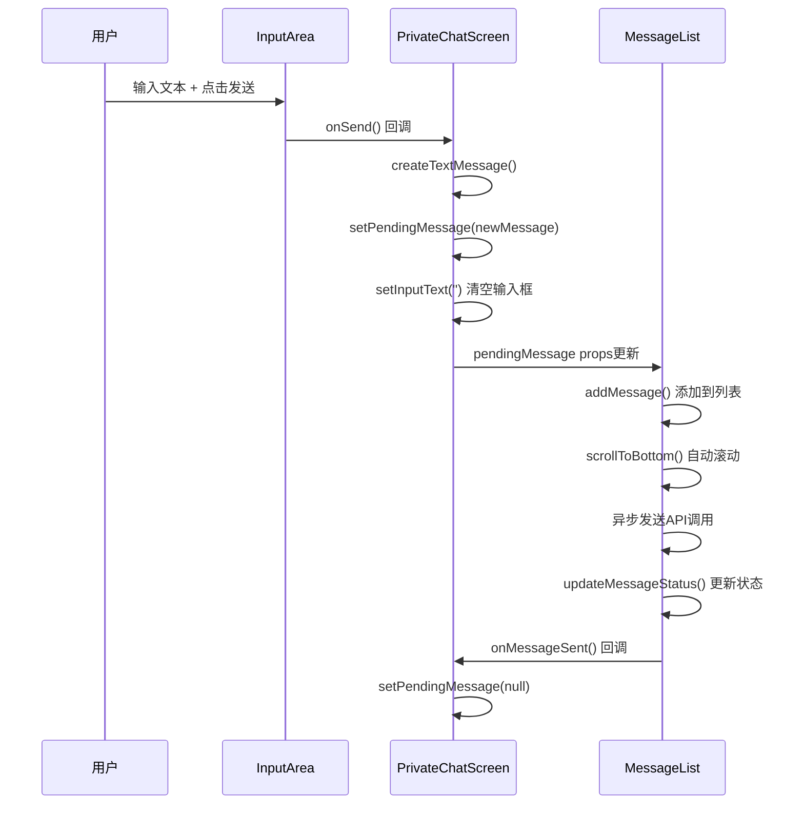

# 私聊模块组件联调机制解决方案

## 🎯 问题分析

在重构为子模块化架构后，遇到了**输入框向上移动逻辑**的问题：
- `PrivateChatScreen`负责输入交互
- `MessageList`负责消息数据和展示
- 需要实现：输入 → 发送 → 添加消息 → 自动滚动

## 🔧 解决方案：状态提升 + 回调通信

### 💡 设计思路

采用**React状态提升模式**，让父组件`PrivateChatScreen`作为数据和交互的协调者：

```typescript
// 父组件管理待发送消息状态
const [pendingMessage, setPendingMessage] = useState<ExtendedChatMessage | null>(null);

// 子组件接收pendingMessage并处理发送逻辑
<MessageList 
  pendingMessage={pendingMessage}
  onMessageSent={() => setPendingMessage(null)}
/>
```

## 📋 实现细节

### 1. PrivateChatScreen - 交互协调层

```typescript
// ==================== 状态管理 ====================
const [inputText, setInputText] = useState('');
const [pendingMessage, setPendingMessage] = useState<ExtendedChatMessage | null>(null);

// ==================== 消息创建逻辑 ====================
const createTextMessage = useCallback((content: string): ExtendedChatMessage => {
  return {
    id: Date.now().toString(),
    senderId: 'currentUser',
    receiverId: userInfo.id,
    content: content.trim(),
    type: 'text',
    timestamp: new Date().toISOString(),
    status: MessageStatus.SENDING,
    isFromMe: true
  };
}, [userInfo.id]);

// ==================== 交互处理 ====================
const handleSendPress = useCallback(() => {
  if (!inputText.trim()) return;
  
  // 1. 创建新消息
  const newMessage = createTextMessage(inputText);
  
  // 2. 设置待发送消息（触发MessageList处理）
  setPendingMessage(newMessage);
  
  // 3. 立即清空输入框（响应式体验）
  setInputText('');
}, [inputText, createTextMessage]);

// ==================== 发送完成回调 ====================
const handleMessageSent = useCallback(() => {
  setPendingMessage(null); // 清空待发送状态
}, []);
```

### 2. MessageList - 数据处理层

```typescript
// ==================== Props接口 ====================
interface MessageListProps {
  userInfo: User;
  pendingMessage?: ExtendedChatMessage | null; // 待发送消息
  onMessageSent?: () => void; // 发送完成回调
  // ... 其他props
}

// ==================== 待发送消息处理 ====================
useEffect(() => {
  if (pendingMessage) {
    // 1. 立即添加到消息列表（即时反馈）
    addMessage(pendingMessage);
    
    // 2. 自动滚动到底部（解决向上移动问题）
    scrollToBottom(true);

    // 3. 异步发送消息
    const sendMessage = async () => {
      try {
        await new Promise<void>(resolve => setTimeout(resolve, 1000));
        updateMessageStatus(pendingMessage.id, MessageStatus.SENT);
      } catch (error) {
        updateMessageStatus(pendingMessage.id, MessageStatus.FAILED);
      } finally {
        // 4. 通知父组件发送完成
        if (onMessageSent) {
          onMessageSent();
        }
      }
    };

    sendMessage();
  }
}, [pendingMessage, addMessage, updateMessageStatus, onMessageSent, scrollToBottom]);
```

### 3. 组件通信流程



## ✅ 解决的核心问题

### 1. 🔄 消息即时响应
- **问题**：用户发送消息后需要等待API返回才能看到消息
- **解决**：立即添加消息到列表，状态为SENDING，给用户即时反馈

### 2. 📱 自动滚动
- **问题**：新消息添加后，列表没有自动滚动到底部
- **解决**：pendingMessage处理时自动调用`scrollToBottom(true)`

### 3. 🎯 输入框清空时机
- **问题**：等API返回后再清空输入框，用户体验差
- **解决**：创建消息对象后立即清空，响应更快

### 4. 🔗 状态同步
- **问题**：父子组件状态不同步，容易出现重复发送
- **解决**：通过`onMessageSent`回调确保状态同步

## 📊 方案优势

### ✅ 技术优势
1. **职责清晰**
   - `PrivateChatScreen`：交互控制 + 消息创建
   - `MessageList`：数据管理 + 列表渲染

2. **状态可控**
   - 单一数据源：`pendingMessage`
   - 明确的状态流转：null → message → null

3. **性能优化**
   - 即时UI响应，无需等待API
   - 自动滚动时机准确

4. **易于扩展**
   - 支持多种消息类型（文本、动态、图片等）
   - 统一的发送机制

### ✅ 用户体验
1. **即时反馈**：输入框立即清空，消息立即显示
2. **自动滚动**：新消息总是可见
3. **状态清晰**：loading → sent → read 状态流转明确
4. **错误处理**：发送失败显示重发按钮

## 🎮 使用示例

### 发送文本消息
```typescript
// 用户在InputArea输入"Hello"并点击发送
// ↓
// PrivateChatScreen.handleSendPress()
const newMessage = createTextMessage("Hello");
setPendingMessage(newMessage);  // 触发MessageList处理
setInputText('');               // 立即清空输入框

// ↓
// MessageList检测到pendingMessage变化
addMessage(newMessage);         // 立即显示消息
scrollToBottom(true);          // 自动滚动
// 异步发送API...
// updateMessageStatus(SENT);   // 更新为已发送
// onMessageSent();             // 通知父组件完成
```

### 发送动态消息
```typescript
// 用户选择发送动态
const dynamicMessage = createDynamicMessage(dynamicContent);
setPendingMessage(dynamicMessage);  // 触发相同的处理流程
```

## 🔮 扩展可能

### 1. 批量消息发送
```typescript
const [pendingMessages, setPendingMessages] = useState<ExtendedChatMessage[]>([]);
// 支持一次发送多条消息
```

### 2. 发送进度显示
```typescript
const [sendingProgress, setSendingProgress] = useState<{[messageId: string]: number}>({});
// 显示文件上传进度等
```

### 3. 离线消息队列
```typescript
const [offlineQueue, setOfflineQueue] = useState<ExtendedChatMessage[]>([]);
// 网络恢复后批量发送
```

## 🎉 总结

这个组件联调方案成功解决了**输入框向上移动逻辑**的问题，通过：

1. **状态提升**：父组件统一管理待发送消息
2. **回调通信**：子组件通过props接收数据和回调
3. **即时响应**：用户操作立即反馈，异步处理业务逻辑
4. **自动滚动**：新消息添加时自动滚动到底部

实现了流畅的聊天体验，同时保持了模块化架构的清晰职责分离。
